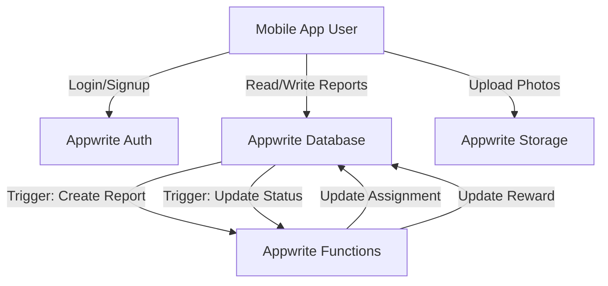

# Appwrite Backend Setup Guide

This guide details the complete backend setup for the Smart Waste Management App using Appwrite.

## 1. Architecture Overview

## 2. Database Schema

### Database: `waste_management_db`

#### Collection 1: `users`
*   **Permissions:**
    *   Read: `users` (Authenticated users can read other users' basic info if needed, or restrict to `user:[ID]`)
    *   Write: `user:[ID]` (Users can update their own profile)
*   **Attributes:**

| Key | Type | Size | Required | Default | Description |
| :--- | :--- | :--- | :--- | :--- | :--- |
| `userId` | String | 255 | Yes | - | Links to Appwrite Auth User ID |
| `name` | String | 255 | Yes | - | Display Name |
| `email` | String | 255 | Yes | - | Email Address |
| `role` | String | 20 | Yes | - | "resident" or "worker" |
| `rewardPoints` | Integer | - | No | 0 | Total points earned |

#### Collection 2: `waste_reports`
*   **Permissions:**
    *   Create: `role:resident` (Only residents can create)
    *   Read: `users` (All authenticated users can see reports - or restrict based on logic)
    *   Update: `users` (Workers need to update status, Residents might need to edit) -> *Better controlled via Cloud Functions for status updates to ensure integrity, but for simple setup, allow `role:worker` to update.*
    *   Delete: `user:[ID]` (Creator can delete)
*   **Attributes:**

| Key | Type | Size | Required | Default | Description |
| :--- | :--- | :--- | :--- | :--- | :--- |
| `residentId` | String | 255 | Yes | - | ID of resident who reported |
| `locationText` | String | 500 | Yes | - | Human readable address |
| `latitude` | Float | - | Yes | - | GPS Latitude |
| `longitude` | Float | - | Yes | - | GPS Longitude |
| `wastePhotoUrl` | Url | - | Yes | - | URL of waste image |
| `status` | String | 20 | Yes | "pending" | pending, assigned, collected |
| `assignedWorkerId` | String | 255 | No | - | ID of worker assigned |
| `pickupPhotoUrl` | Url | - | No | - | URL of cleanup proof |
| `rewardAmount` | Integer | - | No | 0 | Points for this task |
| `collectedAt` | DateTime | - | No | - | Timestamp of collection |

## 3. Storage Buckets

#### Bucket: `waste_photos`
*   **Permissions:**
    *   Read: `any` (Publicly accessible for viewing in app)
    *   Create: `users` (Authenticated users)
    *   Update/Delete: `user:[ID]`

#### Bucket: `pickup_photos`
*   **Permissions:**
    *   Read: `any`
    *   Create: `users`
    *   Update/Delete: `user:[ID]`

## 4. Cloud Functions Setup

You will need to deploy two functions.

### Function 1: `auto-assign-worker`
*   **Runtime:** Node.js 18.0 (or latest)
*   **Trigger:** Event `databases.[ID].collections.waste_reports.documents.create`
*   **Environment Variables:**
    *   `APPWRITE_API_KEY`: API Key with `documents.read` and `documents.write` scope.

### Function 2: `complete-task`
*   **Runtime:** Node.js 18.0 (or latest)
*   **Trigger:** Event `databases.[ID].collections.waste_reports.documents.update`
*   **Environment Variables:**
    *   `APPWRITE_API_KEY`: API Key with `documents.read`, `documents.write`, and `users.update` scope.

## 5. Setup Steps (Manual)

1.  **Create Project:** Go to Appwrite Console -> Create Project "Smart Waste Management".
2.  **Auth:** Enable Email/Password provider.
3.  **Database:**
    *   Create Database `waste_management_db`.
    *   Create Collection `users` with attributes above.
    *   Create Collection `waste_reports` with attributes above.
4.  **Storage:**
    *   Create Bucket `waste_photos`.
    *   Create Bucket `pickup_photos`.
5.  **API Key:**
    *   Go to "Overview" -> "Integrations" -> "API Keys".
    *   Create a key "Cloud Functions" with scopes: `documents.read`, `documents.write`, `users.read`, `users.update`.
6.  **Deploy Functions:**
    *   (Follow the code generation steps in the next section of the assistant's output to get the function code).
    *   Use Appwrite CLI or Console to deploy.
